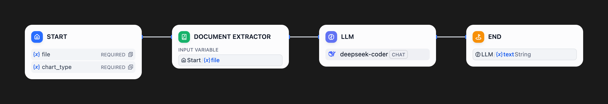
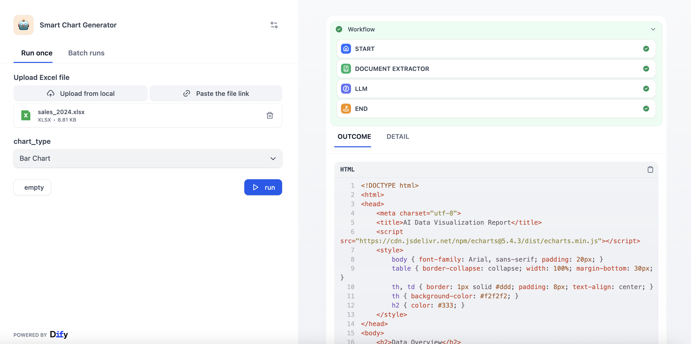

# Smart Chart Generator

**Author:** `dugufeng`
**Tags:** `language:english`, `data-visualization`, `echarts`, `deepseek-coder`, `document-extractor`, `office-automation`
**Dify Version:** `v0.10.0+` (Requires file upload support)

This is a highly efficient office productivity workflow that acts as a "Frontend Visualization Expert." It automatically reads Excel or CSV data uploaded by the user, combines it with the code generation capabilities of DeepSeek Coder, and directly outputs a complete HTML file containing interactive ECharts visualizations.

## 🚀 Pre-conditions

Before running this workflow, please ensure your Dify environment meets the following conditions:

1.  **Model Provider Configuration:**
    * The core logic relies on **DeepSeek Coder** (or a similar model with strong coding capabilities).
    * Please ensure you have configured the DeepSeek API Key in Dify's "Settings -> Model Provider".
    * *(PM Note: Using standard chat models like gpt-3.5 may result in syntax errors in the generated HTML. Coder-class models are strongly recommended.)*

2.  **Knowledge Base / File Parsing Capability:**
    * This workflow uses the `Document Extractor` node. This is a built-in Dify feature requiring no extra config, but ensure your Dify version supports it.

---

## 🚀 How to Use

1.  **Prepare Data:**
    * Prepare a clearly structured Excel (`.xlsx`) or CSV file.
    * **Best Practice:** The first row should be headers (dimensions/metrics), the first column should be the main dimension (e.g., Date/Product), and subsequent columns should be numerical values.
    * *(Sample Data: Column A=Month, Column B=Sales, Column C=Profit)*

2.  **Run Workflow:**
    * **Upload File:** Upload your data table in the `file` input box.
    * **Select Type:** Choose your desired chart form in the `chart_type` dropdown menu (Supports: `Bar Chart`, `Line Chart`, `Pie Chart`, `Stacked Chart`).
    * Click "Run".

3.  **Get Results:**
    * After the workflow finishes, it will output a Markdown code block (`html ...`).
    * Click "Copy" at the top right of the code block.
    * Paste the code into a text editor (like Notepad), save it as a `.html` file, and open it in your browser to view the interactive chart (supports tooltips, legend toggling, and image download).

## 🛠️ Workflow Nodes

* **Start Node:** Defines two user inputs: `file` (Upload Excel/CSV) and `chart_type` (Select Chart Type).
* **Document Extractor:** A core Dify node. It automatically parses the user-uploaded binary file (Excel) into a plain text string readable by the LLM.
* **LLM (Frontend Expert):** (Uses `deepseek-coder`) Receives the parsed text data and the user-specified chart type. The Prompt sets the persona of an ECharts Expert and enforces the output of no-nonsense, complete HTML code containing the ECharts CDN link.
* **End Node:** Outputs the HTML code generated by the LLM directly to the user.

## 📸 Workflow Screenshot

## 📸 Run Screenshot
